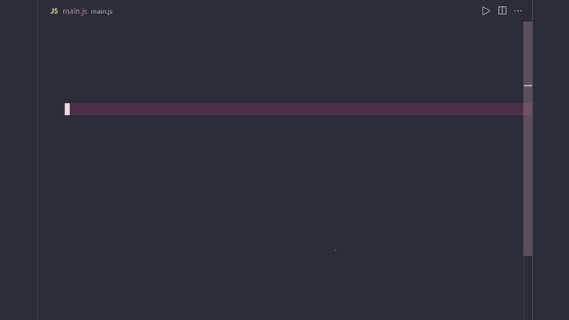
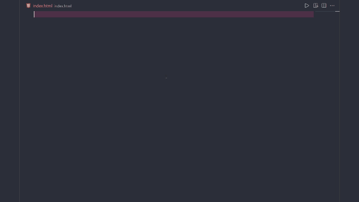
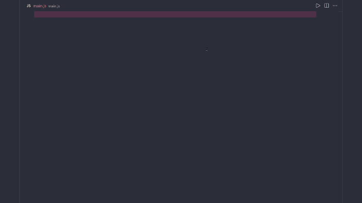
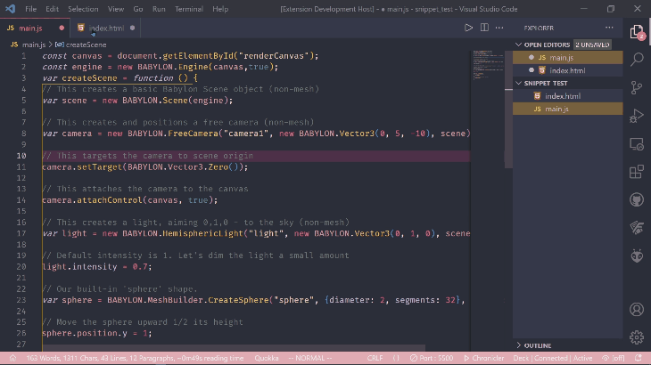

# Babylon.js Snippets

The browser-based [Babylon.js playground](https://playground.babylonjs.com/) is preconfigured with a set of useful code snippets (or "[templates](https://doc.babylonjs.com/toolsAndResources/tools/playground/pgTemplates)"). This plugin makes these and other snippets available to [Babylon.js](https://www.babylonjs.com/) developers using [Visual Studio Code](https://code.visualstudio.com/).

*Babylon.js Snippets* includes all of the snippets from the **playground** along with additional JavaScript and HTML snippets to create and render a default scene with meshes, lights and camera. The snippets are available as a [VSCode plugin](https://marketplace.visualstudio.com/items?itemName=edibotopic.babylonjs-snippets).

## Features

### JavaScript Snippets

JavaScript snippets can be used while editing a `.js` file or while typing within `<script></script>` tags in a `.html` file.

For example, typing `sphere` or `box` will populate the autosuggestion popup with corresponding snippets, which can be then be selected with <kbd>enter</kbd>. These two example snippets would generate:

```js

var sphere = BABYLON.MeshBuilder.CreateSphere("sphere", {diameter: 1}, scene);

//or

var box = BABYLON.MeshBuilder.CreateBox("box", {size: 1}, scene);

```

Once a snippet is generated the cursor will be placed at the first *tab stop*. In each of the cases above this will be the *name* of the mesh. After editing the name you can then <kbd>tab</kbd> through the next editable arguments in the sequence.



### HTML Snippets

All babylon.js projects require an `index.html` that loads the Babylon.js engine and contains a *canvas* element with `id` where the scene will be rendered.

While editing your `index.html` begin typing *HTML scene* and you should see a snippet to create the necessary boilerplate:



The `index.html` references a script `main.js` that can be populated with the *JS scene* snippet:



## Steps for Quick Scene Setup

Open a terminal and enter the following commands (example here is in `Bash` - modify as needed):

```bash

mkdir myProject
cd myProject
touch main.js index.html
code .

```

1. After VSCode opens, invoke the `JS scene` snippet in `main.js`:

2. Invoke the `HTML scene` snippet in `index.html`:

3. Save both files and run `index.html` with live server.

4. You should see the following default scene



## Known Issues

The plugin currently doesn't support TypeScript snippets.

## Release Notes

### 1.0.0

Major initial release of plugin containing all major snippets from the Babylon.js playground along with the following for creating a default scene:

- HTML Scene
- JS Scene

### 1.0.1-1.0.5

Minor patches:

- Fixed some typos
- Marketplace header readability
- Improved README
- Added license
- More consistent naming
- Added CHANGELOG

### 1.0.1-1.0.5

- Removed comments with incorrect syntax in *HTML scene* snippet
- Trimmed some fat in snippet extensions

-----------------------------------------------------------------------------------------------------------

## Contributing

I can add more snippets as/if they are suggested.

### For more information

- [Babylon.js homepage](https://www.babylonjs.com/)
- [Babylon.js file viewer plugin for VSCode](https://marketplace.visualstudio.com/items?itemName=julianchen.babylon-js-viewer)
- [Babylon.js playground](https://playground.babylonjs.com/)
- [Video on Babylon.js Playground snippets](https://youtu.be/SRvCe6N7mdE)

**I hope someone finds this useful!!!**
